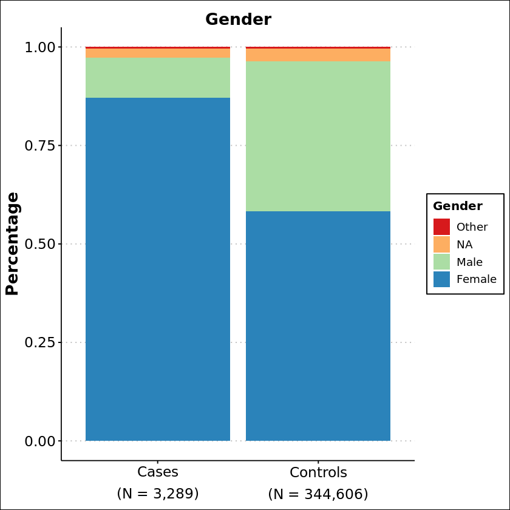
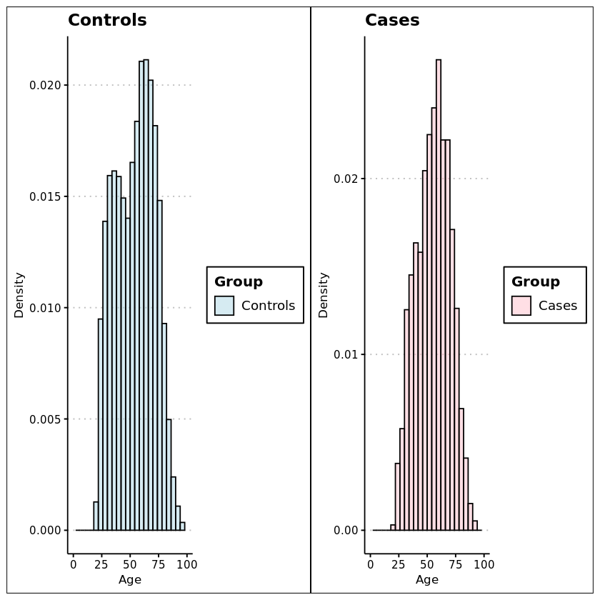
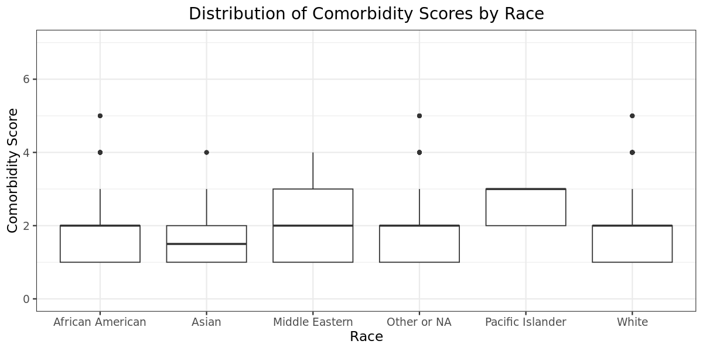
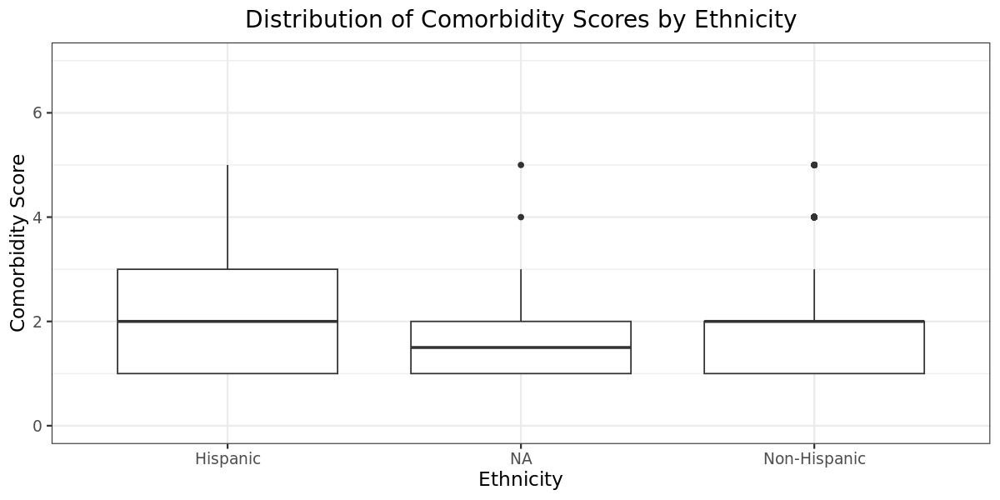
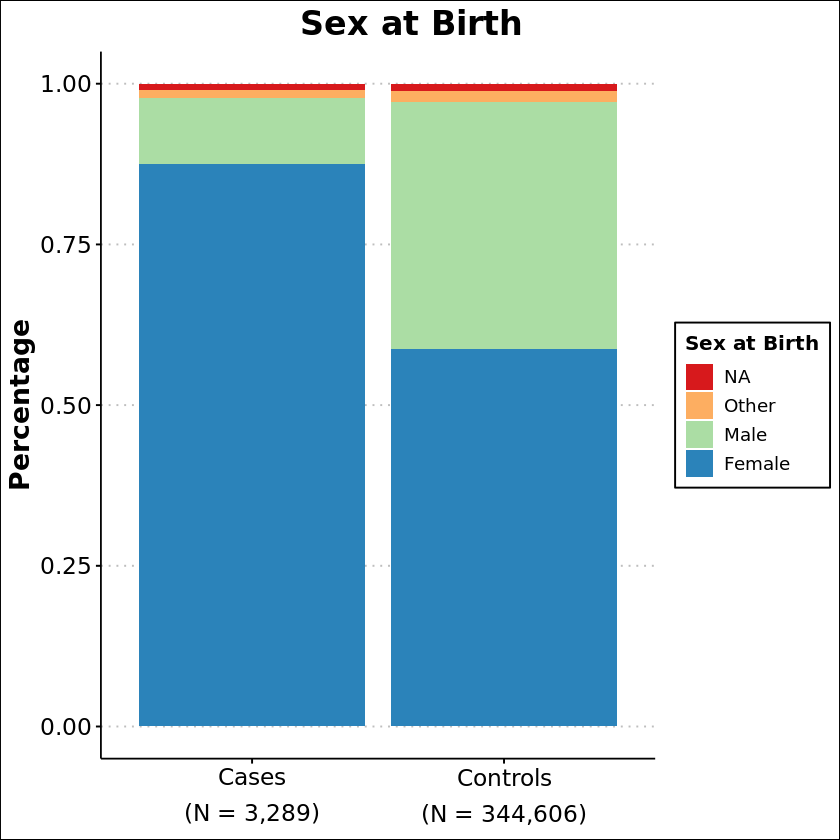
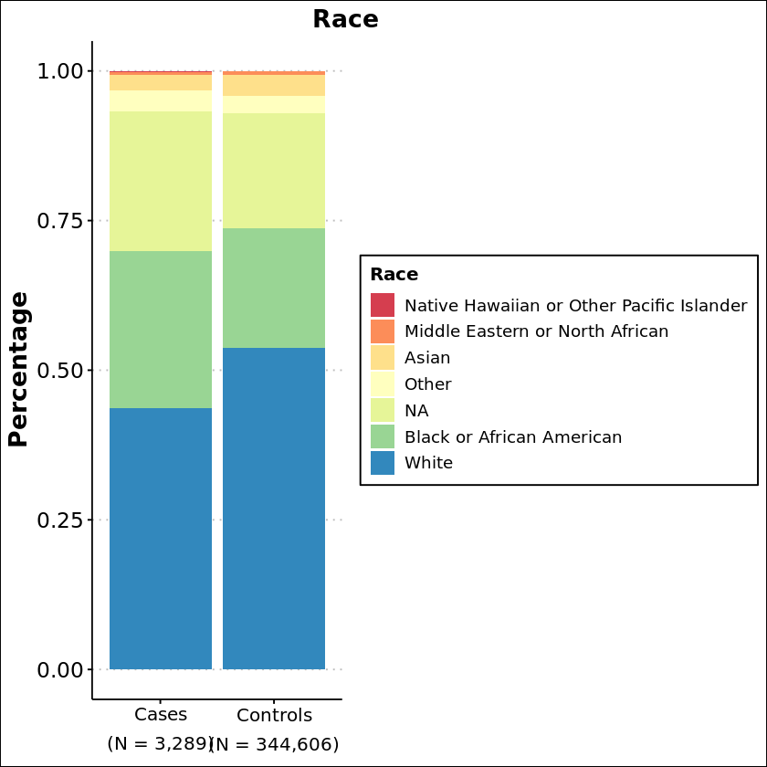
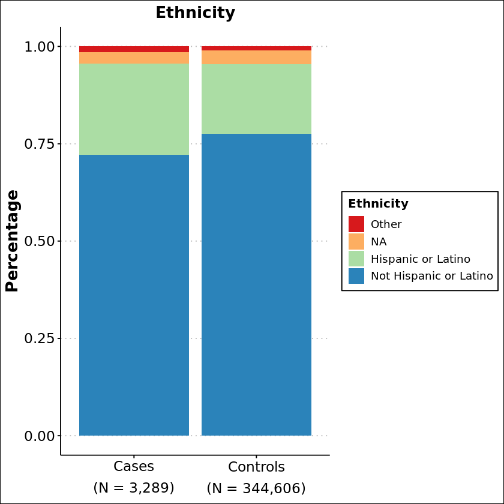

```{r setup, include=FALSE}
knitr::opts_chunk$set(echo = TRUE,
                      warning = FALSE,
                      eval = FALSE,
                      message = FALSE)
library(prettydoc)
```

For my final project, I decided to visualize some of the data from my Thesis/Dissertation and potentially use these visualizations in my thesis!!

## Systemic Lupus Erythematosus (SLE)

Systemic Lupus Erythematosus or SLE is an autoimmune disorder that is characterized by systemic inflammation and damage to tissues. The genetic basis of this disease is not well studied in individuals of differing ancestries, and so my thesis focuses on broadening this disparity by including a large cohort of diverse ancestries including those of Hispanic ethnicity, European/White, Asian, African Americans, and others to investigate the genetic and chronic factors associated with an increased risk in SLE.  

It has been shown that manifestations of SLE hold a higher risk in individuals that are either **Female**, **Hispanic**, or **of older Age**.

One aspect of my project entails analyzing both the demographic and heterogeneous manifestations of SLE in the form of comorbidities (or merely "side effects" of having SLE).

Unfortunately, I could not include this data into my presentation, because it is encrypted in a biobank (All of Us: National Institute of Health). However I will go ahead an describe the two cohorts we are examining in this project.

## Describing our Cohorts

For my project we employed two cohorts that we use in our analyses:

(1) **Cases Cohort** : Defined as individuals that have SLE (N = 3,289)

(2) **Control Cohort**: Defined as individuals without any autoimmune disorders (N = 344,606)

## Purpose of Datasets

For this visualization, I decided to use two separate analyses, breaking up this project into two parts:

1)  I decided to use a demographic dataframe with a joined dataset of Cases and Controls demographic data to describe and compare our cohorts by 5 different demographics: **Race, Ethnicity, Gender, Sex at Birth, and Age**

2)  Next I decided to use a comorbidity dataset of SLE affected individuals to investigate the heterogeneous manifestations of SLE; this includes investigating the demographics associated with these varied manifestations and the distribution of comorbidities throughout ancestries (we can use analysis to deem significance if any amongst a specific manifestation to an ancestry)

## Metadata

The data I am using for this project comes from NIH's All of Us Researcher Workbench and uses a collection of data from electronic health records, survey answers, physical measurements, and wearable devices like Fitbits. Registered Tier data are adjusted to lower the chance that any researcher can identify any one participant. For example, researchers cannot see a participant’s exact location, only the state where they live.

The curated dataset I am using may be accessed by registered researchers in the All of Us Researcher Workbench. Registered Tier data includes individual-level data from surveys, physical measurements taken at the time of participant enrollment, longitudinal Health Records, and data from wearables like Fitbit. This individual-level data must be analyzed within the secure Researcher Workbench

# Visualization #1 & #2 - Demographics

### Data Dictionary

| Column Name  | Data Type |                                         Description |
|:-------------------------:|:----------------:|--------------------------:|
|  person_id   |  Numeric  |             Unique ID of every patient in a dataset |
|    gender    | Character |                          The gender of each patient |
|     age      |  Numeric  |                          Age of each unique patient |
|     race     | Character |                         Race of each unique patient |
|  ethnicity   | Character | Hispanic or non-Hispanic Ethnicity for each patient |
| sex_at_birth | Character |                       Sex at Birth for each patient |
|    group     | Character |          Either denoted as SLE "Cases" or "Control" |

### Load Libraries

```{r}
library(tidyverse)
library(ggthemes)
library(devtools)
library(patchwork)
```

### Control + Cases Demographic Datasets

We have two datasets that have the same data dictionary and only differ in the values/quantity of values presented in each dataset:

> **Cases** = df_5demo_uniq
> **Controls** = df_5control_demo_uniq

We then add a column with grouping to these datasets so when joined, we are able to subset them:

```{r}
df_5demo_uniq$group <- "Cases" # add a column called "group" to denote either cases or control
df_5control_demo_uniq$group <- "Controls"
```

### Data Wrangling and Demographic Analyses

We want to compare demographic values between our Cases and Controls cohorts based on the occurrence of SLE in a demographic

> For instance, if someone is female [or other demographic], does that increase the chance that they would have SLE?

### Gender Demographic

#### First, we filter out unwanted values

Here we want to filter out some gender values since we have too many unique values for both Cases and Control datasets

Data Wrangling for **Cases** Gender Demographic:

```{r}
##### Subsets some CASES gender values into a "NA" Category ########

# groups all extra values of these into "NA" category using ifelse

df_5demo_uniq$gender <- ifelse(df_5demo_uniq$gender %in% 
                                 c("PMI: Skip",  
                                    "I prefer not to answer",
                                    "Not man only, not woman only, prefer                                                                not to answer, or skipped"), 
                                   "NA", 
                                   df_5demo_uniq$gender) 


# groups all of these extra values in "Other" category using ifelse

df_5demo_uniq$gender <- ifelse(df_5demo_uniq$gender %in% 
                                 c("Gender Identity: Transgender", "Gender Identity: Non Binary",
                                    "Gender Identity: Additional Options"), 
                                    "Other", 
                                    df_5demo_uniq$gender)
```

Data Wrangling for **Control** Gender Demographic:

```{r}
# groups all CONTROL extra gender variables

# groups all extra values of these into "NA" category using ifelse

df_5control_demo_uniq$gender <- ifelse(df_5control_demo_uniq$gender %in% 
                                                            c("PMI: Skip", 
                                                            "I prefer not to answer",
                                                            "Not man only, not woman only, prefer                                                               not to answer, or skipped",
                                                            "No matching concept"), 
                                                            "NA", 
                                                            df_5control_demo_uniq$gender)


# groups all of these extra values in "Other" category using ifelse

df_5control_demo_uniq$gender <- ifelse(df_5control_demo_uniq$gender %in% 
                                                            c("Gender Identity: Transgender", 
                                                            "Gender Identity: Non Binary",
                                                            "Gender Identity: Additional Options"), 
                                                            "Other", 
                                                            df_5control_demo_uniq$gender)

```

#### Next, we COMBINE these two datasets to create a dataset for our gender counts and subsets

To create a dataframe with each dataset possessing the same variables, I didn't use a dplyr join function instead I used a base R rbind() function that adds the datasets vertically rather than horizontally!

```{r}

data_gender <- rbind(
  df_5demo_uniq,df_5control_demo_uniq)   # this adds control and cases datasets together to form a new dataset known as "data_gender" that includes all the values from both datasets with a group column that denotes "Control" or "Case"

```

#### Lastly, we can plot out data into something useful

Now that our data is filtered out we then can count the instances of genders subset through both groups (Cases and Controls) and plot them into a graph


Here we count our occurrences of each gender per grouping and turn it into a percentage

```{r}
gen_counts <- data_gender %>% # This counts all instances of different genders between cases and controls groupings
  count(group, gender)

# Calculate the percentage of each gender within each group

gender_percent <- gen_counts %>% 
  group_by(group) %>% 
  mutate(Percent = n /sum(n) * 100) # creates a new Percent column with the relative percentages of counts
```


Next, we do a little editing to our bars by putting them into ascending order, creating labels, and editing our plot to look publication ready!

```{r}
# Reorder the bars to be in ascending order

gender_percent$gender <- reorder(gender_percent$gender, gender_percent$Percent)

# Creates a label with our sample size values under our graph

label_sample_sizes <- expression(atop(paste("Cases"), paste("(N = 3,289)")), # creates a label under 
                    atop(paste("Controls"), paste("(N = 344,606)"), size = 0.4)) 

# Plot our stacked bar plots using percentage rather than our unscaled counts in gen_count

ggplot(gender_percent, aes(x = group, y = Percent, fill = gender)) + # uses our new dataset with aesthetics
  geom_bar(stat = "identity", position = "fill") + # creates a stacked barplot
  labs(title = "Gender", x = "Group", y = "Percentage", fill = "Gender") + # adds labels
 scale_fill_brewer(palette = "Spectral") + # adds a R package color scheme brewer
    theme_clean() + # changes theme
    theme(axis.text.x = element_text(size = 14), # alters element text sizes and positions
         axis.text.y = element_text(size = 14),
         axis.title.x = element_blank(),
         axis.title.y = element_text(size = 16, vjust = 1.2, face = "bold"),
         plot.title = element_text(size = 16, hjust = 0.5, vjust = -1.2)) +
    scale_x_discrete(labels = label_sample_sizes) # adds x-axis label

```


This graph shows us that there exists a strong female bias in patients diagnosed with SLE which is very much supported by past literature on Lupus. (strong 9:1 female bias)


### Age Demographic

For this demographic, it wouldn't make sense to create a barplot, therefore we create a histogram to show distribution

#### First, we COMBINE dataframes to compare age between both Cases and Controls

```{r}
df_age <- rbind(df_5control_demo_uniq, df_5demo_uniq) # combines both control and cases datasets vertically

```

Combine our original datasets to create a new one titled "df_age" using rbind

#### Next, we want to graph age as a distribution

Since it wouldn't make sense to graph age in a barplot, we will use distribution of a histogram scaled by density of each cohort **separately**

For **Controls**:
```{r}

age_controls <- ggplot(df_5control_demo_uniq, aes(x = age, fill = group)) + # creates aesthetics for our age in controls
  geom_histogram(binwidth = 4, position = "dodge", # creates a histogram with columns that are black and transparent
                 alpha = 0.5, 
                 color = "black", 
                 aes(y = after_stat(density))) + # creates a density plot
  labs(x = "Age", y = "Density", title = "Controls") + # creates labels
  scale_fill_manual(values = c("lightblue"), name = "Group") + # changes legend title and color 
  theme_clean() + 
    xlim(0, 100)
```

For **Cases**:
```{r}
age_cases <- ggplot(df_5demo_uniq, aes(x = age, fill = group)) + # creates aesthetics for our age in cases
  geom_histogram(binwidth = 4, position = "dodge", # creates a histogram with columns that are black and transparent
                 alpha = 0.5, 
                 color = "black",
                 aes(y = after_stat(density))) +     # creates a density plot
  labs(x = "Age", y = "Density", title = "Cases") +      # creates labels
  scale_fill_manual(values = c("pink"), name = "Group") +   # changes legend title and color to pink
  theme_clean() + 
xlim(0,100)
```


#### Lastly, we can combine these two plots using patchwork 

To create a comparison of ages between cases and controls we use patchwork to paste in both of our plots side by side and change the width to our plotting area for max fit of our plots!

```{r}
combined_age <- age_controls + age_cases # adds both of these plots together

combined_age  + plot_layout(widths = c(20, 20)) # increases the margin for the plot to max width
```




In this comparison we see that the mean (average) age for individuals diagonsed with SLE are higher than that of the controls cohort

> Mean (Cases): 55.8  
Mean (Control): 54.6

This is supported by past evidence as older age is a good determinant of illness and autoimmune disorders


# Visualization #3 - Comorbidity Scores

In this visualization, we are investigating the frequencies of certain types of the most common SLE comorbidities within different ancestries to determine which ancestral group holds the most increase in risk of SLE severity.  

We want to do this by creating a **boxplot** that includes the frequencies of each comorbidity types across different races and ethnicities!!

This visualization uses all of the participants from our SLE cohort (N = 3,289)

### Data Dictionary


| Column Name  | Data Type |                                         Description |
|:-------------------------:|:----------------:|--------------------------:|
|  person_id   |  Numeric  |             Unique ID of every patient in a dataset |
|    gender    | Character |                          The gender of each patient |
|     race     | Character |                         Race of each unique patient |
|  ethnicity   | Character | Hispanic or non-Hispanic Ethnicity for each patient |
| standard_concept_name | Character |  Comorbidity values separated by commas |
| commor_score |  Numeric  | Denotes severity of SLE on an arbitrary scale of 1-6|


Within our **standard_concept_name** column, comorbidities are written as comma-separated values:  

> Example: "Hemoglobin deficiency due to Anemia", "Renal Disease due to Nephritis", "Atrioventricular fibrillation"

### Load Libraries

```{r}
library(tidyverse)
library(ggthemes)
library(devtools)
library(patchwork)
```

### Describing our Cohort

These most common comorbidities include those of **renal, cardiovascular, and chronic** conditions with our main focus on the incidence of 6 of these conditions within our SLE cases cohort:

    1) Anemia
    2) Cardiac Arrhythmia
    3) Nephritis
    4) SLE Glomerulonephritis Syndrome
    5) Lupus Hepatitis
    6) Rheumatoid Arthritis  

Using the All of Us workbench, we were able to create a "concept set" in which **individuals affected with SLE** have also been documented with having any 6 of these conditions thus labeling them as "comorbidities"  

All of these comorbidities are written in the **standard_concept_name** column!!!!!!  

However, using the AoU database is kind of tricky as the comorbidities aren't plain and simple!!  

> In the AoU database, when analyzing these comorbidities they are not listed as just "Anemia" but rather something like "Hemoglobin deficiency due to hemolysis and anemia"  

Although not exactly the same thing, this is considered Anemia because these diagnoses come from medical records and medical visits therefore, we need to do a little bit of data wrangling!!


### Data Wrangling and Comorbidity Analysis

First, we wanted to change all the instances of different medical visit comorbidities into the actual comorbidiity we are analyzing so we don't have 200 unique values since each value is separated by a comma; to do this we can use regex and string character alterations to change instances of specific keywords into our keyword (one of our 6 comorbidities)!

> Think about it like this, most of the individuals who have a unique comorbidity such as "Renal Damage due to Nephritis" fall under the "Nephritis" umbrella

Therefore we create a for loop to solve this problem!

- Create a list of diagnoses where each value is stripped after a comma
```{r}
diagnosis_list <- strsplit(SLE_Com_Analysis$standard_concept_name, ",") # split the comma-separated values into different elements

```

- Then we create a for loop to iterate through the list and find any mentions of "Anemia" or "anemia" and replace the entire thing we just "Anemia"

```{r}

# loop through each element and replace the ones that contain "Anemia" or "anemia" anywhere in the value with just "Anemia" by using a word boundary (//b)!!!!

for (i in diagnosis_list) { # look in diagnosis list and find all the values
  if (any(grepl("\\bAnemia\\b", diagnosis_list[[i]], ignore.case = TRUE))) { # search for IF any anemia in a word boundary
    diagnosis_list[[i]][grepl("\\bAnemia\\b", diagnosis_list[[i]], ignore.case = TRUE)] <- "Anemia"
  } # THEN when found any "anemia" is found change it to "Anemia"
} 

SLE_Com_Analysis$standard_concept_name <- sapply(diagnosis_list, paste, collapse = ",") # put the edited elements back into the comma-separated string

```

Now by changing the grepl criteria we were able to search and change each set of individual comorbidities we were left with - instead of searching for "Anemia" replace it with any another comorbidity (Ex: Nephritis)

This allowed us to bring down our unique values from 183 to only the 6 we wanted to look at!!!!

Next, we then used another for loop to iterate out any duplicates of these 6 comorbidities that are comma separated within our rows:

```{r}
for (i in 1:nrow(SLE_Com_Analysis)) {
  
  split_them <- strsplit(SLE_Com_Analysis$standard_concept_name[i], ",")[[1]] # split values of standard_concept_name everytime there is a comma
  
  trim_values <- str_trim(split_them) # trim all whitespace out of the column values
    
  remove_duplicates <- unique(trim_values) # remove any duplicate values
  
  newstring <- paste(remove_duplicates, collapse = ",") # combine these now unique values back into a comma separated string
  
  SLE_Com_Analysis$standard_concept_name[i] <- newstring # replace each row with these new string values
  
}
```


Next, now that we were left with the 6 **unique comorbidity values in the standard_concept_name** column     

We removed the duplicated values of the same occurence of a comorbidity per row and so this means we could have an individual patient that experiences a multitude of comorbidities so we want to create an **arbitrary** value that denotes the *severity of SLE* per race/ethnicity for every individual based on the amount of comorbidities one faces    
To do this we create a row called commor_score that counts the amount of comorbidities per individual and then we can subset that per race

```{r}
SLE_Com_Analysis$commor_score <- str_count(SLE_Com_Analysis$standard_concept_name, ",") # counts the occurrence of every comma in a row of standard_concept_name and creates a count in a new column

SLE_Com_Analysis$commor_score <- SLE_Com_Analysis$commor_score + 1 # we add 1 to the count to adhere for the occurence of a single comorbidity without any commas
```


Lastly, we are left with some filtering of race and ethnicity values to create a nice plot without mumbled race values in our x-axis

```{r}

# Creates an ifelse function where we take the unique values of rows and put them into a different grouping

# Changes unanswered or not specificed race to "NA or Other"
SLE_Com_Analysis$race <- ifelse(SLE_Com_Analysis$race %in% c("More than one population", "None of these","None Indicated", "I prefer not to answer", "PMI: Skip"), "Other or NA", SLE_Com_Analysis$race)


# Changes "Black or African American" to "African American"
SLE_Com_Analysis$race <- ifelse(SLE_Com_Analysis$race %in% c("Black or African American"), "African American", SLE_Com_Analysis$race)


# Changes Native Hawaiian or Other Pacific Islander to just "Pacific Islander"
SLE_Com_Analysis$race <- ifelse(SLE_Com_Analysis$race %in% c("Native Hawaiian or Other Pacific Islander"), "Pacific Islander", SLE_Com_Analysis$race)


# Changes Middle Eastern or Northern African to Middle Eastern
SLE_Com_Analysis$race <- ifelse(SLE_Com_Analysis$race %in% c("Middle Eastern or North African"), "Middle Eastern", SLE_Com_Analysis$race)

```

Create a plot of Races with comorbidity scores:
```{r}
###  Races #####################################
ggplot(SLE_Com_Analysis, aes(x = race, y = commor_score)) + # use race and comor_score as the aesthetics
  geom_boxplot() + # create a boxplot
  labs(title = "Distribution of Comorbidity Scores by Race", # creates labels
       x = "Race",
       y = "Comorbidity Score") +
ylim(0,7) + # sets a y limit
theme(plot.title = element_text(hjust = 0.5)) # changes plot title position
```





Now we filter out the values for our ethnicity column:

```{r}
# Creates an ifelse function where we take the unique values of rows and put them into a different grouping


# Changes No ethnicity answer to Non-Hispanic
SLE_Com_Analysis$ethnicity <- ifelse(SLE_Com_Analysis$ethnicity %in% c("Not Hispanic or Latino", "What Race Ethnicity: Race Ethnicity None Of These"), "Non-Hispanic", SLE_Com_Analysis$ethnicity)


# Changes Skipped ethnicity to NA
SLE_Com_Analysis$ethnicity <- ifelse(SLE_Com_Analysis$ethnicity %in% c("PMI: Skip","PMI: Prefer Not To Answer" ), "NA", SLE_Com_Analysis$ethnicity)


# Changes Hispanic or Latino to "Hispanic"
SLE_Com_Analysis$ethnicity <- ifelse(SLE_Com_Analysis$ethnicity %in% c("Hispanic or Latino" ), "Hispanic", SLE_Com_Analysis$ethnicity)
```

And create a comparison of Non-Hispanic Races to Hispanic races to compare scores of both ethnicity groups

```{r}
ggplot(SLE_Com_Analysis, aes(x = ethnicity, y = commor_score)) + # use race and comor_score as the aesthetics
  geom_boxplot() + # create a boxplot
  labs(title = "Distribution of Comorbidity Scores by Ethnicity",   # creates labels
       x = "Ethnicity",
       y = "Comorbidity Score") +
ylim(0,7) + # sets new y limit
theme(plot.title = element_text(hjust = 0.5)) # changes plot title position
```




This plot shows us the distribution of Ethnicities, where we can see that Hispanic ethnicity carries a higher burden of SLE comorbidities on average relative to the NA and Non-Hispanic groups.  
  
  
  
  
# Supplemental Figures - Demographics









